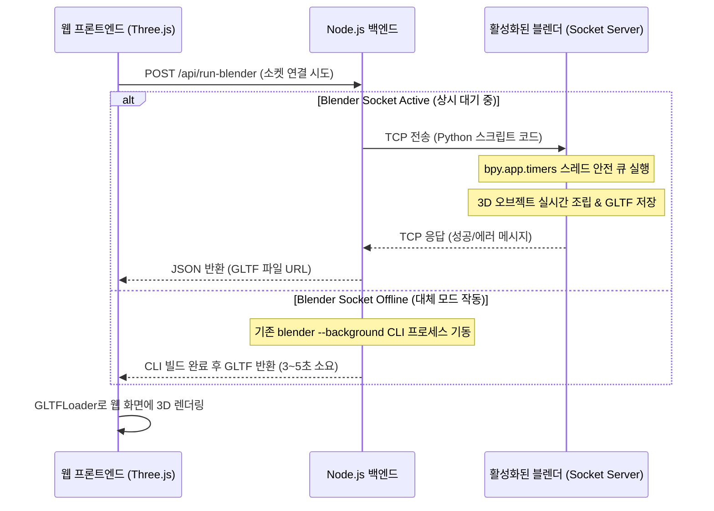

# 실시간 소켓 기반 블렌더 연동 3D 모델 생성기 구현 계획서

웹 프로그램과 실제 실행 중인 블렌더(Blender) 프로세스 간의 TCP 소켓(Socket) 통신 레이어를 결합하여, 사용자가 프롬프트를 치면 **현재 실행 중인 블렌더 창에 즉각 3D 형상이 실시간 렌더링되고 웹 뷰어로도 동시에 로드**되는 초고속 연동 시스템을 구현합니다.

---

## 시스템 아키텍처 (실시간 소켓 모드)

---

## 주요 변경 파일 설계

### 1. [NEW] [blender_socket_server.py](file:///c:/Users/samsung/proj/model3d/blender_socket_server.py)
* 사용자가 블렌더(Blender) 내부에서 실행할 독자적인 파이썬 백그라운드 서버 프로그램입니다.
* 블렌더의 메인 렌더링 루프를 차단하지 않는 스레드 안전(Thread-safe) 통신 모델 구축:
  - 수신용 백그라운드 TCP 스레드 구동 (기본 포트: `5555`).
  - 수신된 파이썬 코드를 글로벌 큐(`queue.Queue`)에 임시 보관.
  - `bpy.app.timers.register`를 사용하여 메인 스레드에서 0.1초마다 큐를 감시하고 블렌더 핵심 스레드 컨텍스트 내에서 `exec()` 명령을 처리.
  - 처리 완료 시 `scratch/output.gltf`로 실시간 내보내기 수행 후 클라이언트에 소켓 완료 신호 송신.

### 2. [MODIFY] [server.js](file:///c:/Users/samsung/proj/model3d/server.js)
* `/api/run-blender` 라우트 로직 개선:
  - 프론트엔드로부터 `socketMode: true` 요청이 올 경우, `net.createConnection({ port: 5555 })`로 로컬 블렌더 서버 접속 시도.
  - 연결 성공 시, 파이썬 소스 코드를 전송하고 완료 대기.
  - 연결 실패 또는 타임아웃 발생 시, 자동으로 **기존 백그라운드 CLI 프로세스 빌드 모드로 폴백(Fallback)** 실행하여 견고성을 유지.

### 3. [MODIFY] [index.html](file:///c:/Users/samsung/proj/model3d/index.html)
* 설정(Settings) 탭에 **"실시간 소켓 연동"** 옵션 배치:
  - 소켓 연동 활성화 스위치 (Checkbox/Toggle).
  - 소켓 통신 포트 설정 필드 (기본값: `5555`).
  - **"블렌더 연동용 파이썬 파일 다운로드"** 버튼 신설.

### 4. [MODIFY] [app.js](file:///c:/Users/samsung/proj/model3d/app.js)
* 프론트엔드 제어 추가:
  - 설정 값 읽기 및 소켓 활성화 상태 관리.
  - 생성 트리거 작동 시 `socketMode` 플래그 및 포트 번호를 동봉하여 `/api/run-blender` 호출.
  - 설정 페이지에서 **블렌더용 서버 파이썬 스크립트 파일**을 내려받을 수 있는 다운로드 트리거 연동.

---

## 검증 계획
1. **소켓 통신 연결성 검증**: 블렌더를 실행하고 `blender_socket_server.py`를 작동시킨 후, 프론트엔드에서 신호를 보냈을 때 수 밀리초(ms) 단위 내로 즉각 3D 사물이 형성되는지 확인합니다.
2. **자동 폴백(Fallback) 검증**: 블렌더가 꺼져 있거나 소켓 서버가 꺼져 있을 때, 프로그램이 멈추지 않고 CLI 백그라운드 방식으로 자동 전환되어 메쉬를 렌더링해주는지 확인합니다.
