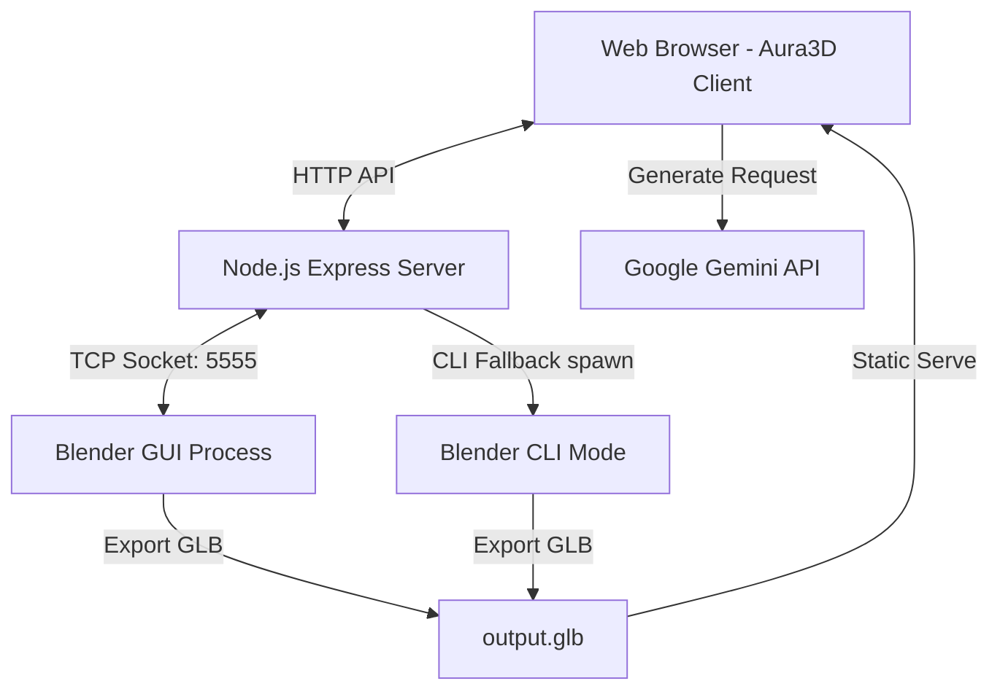
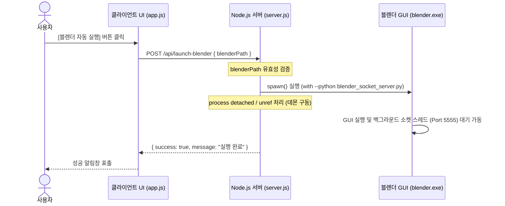
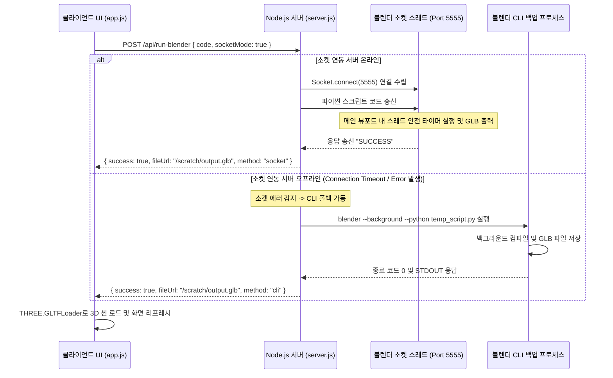

# Aura3D - 자연어 AI 3D 모델 생성기 프로그램 설계 문서 (System Architecture & Design)

본 문서는 자연어 프롬프트 입력을 기반으로 3D 모델을 자동 생성하는 **Aura3D**의 시스템 아키텍처, 구성 모듈, 데이터 흐름 및 실시간 연동 프로토콜을 정의하는 설계 문서입니다.

---

## 1. 시스템 아키텍처 개요 (System Architecture)

Aura3D는 3가지 방식(로컬 휴리스틱 파서, 웹 브라우저 내 Three.js 스크립트 실행, 로컬 블렌더 백그라운드 서버 연동)의 생성 엔진을 하이브리드로 채택하여 구동되는 웹 애플리케이션입니다.

### 1.1 하이 레벨 컴포넌트 뷰


---

## 2. 생성 엔진별 메커니즘 (Generation Modes)

사용자의 환경과 요구사항에 따라 3가지 독립적인 빌드 메커니즘을 동적으로 스위칭합니다.

### 2.1 Local Engine (오프라인 모드)
- **개념**: 별도의 AI 키나 외부 프로그램 연동 없이, 한국어 자연어 형태소에서 주요 키워드(도형 종류, 색상, 배치 등)를 정규식 기반으로 분류해 Three.js 원시 객체(Primitive)로 즉각 구현합니다.
- **적용**: 네트워크 오프라인 상태나 빠른 레이아웃 스케칭 시 활용.

### 2.2 Three AI Engine (브라우저 가상 샌드박스)
- **개념**: Gemini API를 이용해 사용자 질의에 대응하는 **Three.js JavaScript 코드**를 런타임에 직접 생성합니다.
- **실행**: 클라이언트 브라우저가 생성된 코드를 전달받아 `new Function()` 기반의 격리된 샌드박스 공간에서 컴파일하여 메인 웹뷰어 씬(`modelGroup`)에 로드합니다.

### 2.3 Blender AI Engine (로컬 블렌더 소켓 & CLI 연동)
- **개념**: 실사 렌더링 및 모디파이어(Modifier), 매테리얼 쉐이더 노드 편집 등 전문적인 3D 저작을 위해 로컬 블렌더의 Python API(`bpy`)를 활용합니다.
- **연동 흐름**:
  1. **Gemini API**가 자연어 지시사항에 알맞은 Blender Python 코드를 작성합니다.
  2. 웹 브라우저는 백엔드 서버(`/api/run-blender`)에 해당 스크립트를 전달합니다.
  3. 백엔드는 **실시간 TCP 소켓** 통신을 통해 이미 켜져 있는 블렌더 내부로 코드를 주입하거나, 블렌더가 꺼져 있을 경우 **CLI 백업 모드**로 가동하여 즉각 3D 에셋(.glb)을 굽고 웹 브라우저 뷰어에 투영합니다.

---

## 3. 핵심 인터랙션 흐름도 (Core Workflows)

### 3.1 블렌더 GUI 자동 실행 & 소켓 활성화 시퀀스
사용자가 매번 터미널을 열거나 수동으로 스크립트를 올리지 않고, 버튼 클릭 한 번으로 통신 파이프라인을 기동하는 로직입니다.



### 3.2 실시간 소켓 빌드 및 자동 폴백 (Fallback) 시퀀스
생성된 Python 스크립트를 소켓과 CLI 방식을 활용해 안전하게 컴파일하는 다이나믹 핸들링 과정입니다.



---

## 4. 파일 구성 및 역할 분담 (Component Structure)

Aura3D 프로젝트는 최소한의 오버헤드를 유지하기 위해 아래와 같이 깔끔하게 모듈화되어 설계되었습니다.

| 파일명 / 경로 | 기술 스택 | 주요 역할 및 핵심 로직 |
| :--- | :--- | :--- |
| **`index.html`** | HTML5 | UI 뼈대, 탭 컨테이너(생성/갤러리/설정), Material Symbols 아이콘 적용, Three.js 라이브러리 로더. |
| **`style.css`** | CSS3 | HSL 컬러 토큰 기반 프리미엄 다크 테마 디자인, 모달 및 런타임 로그 레이아웃 스타일링, 글래스모피즘 효과. |
| **`app.js`** | JavaScript | 웹 프론트엔드 제어부. Three.js 초기화(카메라/라이팅/컨트롤 줌 한계 완화), 로컬 파싱 엔진, Gemini API 직접 통신 및 백엔드 AJAX 브릿징. |
| **`server.js`** | Node.js, Express | 로컬 개발 서버 및 블렌더 브릿지 백엔드. TCP 소켓 통신 모듈(net), 블렌더 비동기 데몬 생성(spawn) 및 CLI 제어(exec) 실행부 관리. |
| **`blender_socket_server.py`** | Python (Blender) | 블렌더 상주용 서버 스크립트. 비동기 락-프리 TCP 리스너 스레드 구동 및 `bpy.app.timers`를 통한 블렌더 큐 핸들러 동작. |

---

## 5. 데이터 명세 및 API 규격 (API Design & Contracts)

### 5.1 POST `/api/launch-blender`
- **목적**: 블렌더 GUI 자동 실행 및 상주 소켓 리스너 스크립트 탑재
- **요청 Body (JSON)**:
  ```json
  {
    "blenderPath": "C:\\Program Files\\Blender Foundation\\Blender 4.0\\blender.exe"
  }
  ```
- **응답 (JSON)**:
  ```json
  {
    "success": true,
    "message": "블렌더 프로그램이 실행되었습니다. 곧 소켓 서버가 활성화됩니다."
  }
  ```

### 5.2 POST `/api/run-blender`
- **목적**: 생성된 파이썬 스크립트를 전송하여 3D 모델(GLB)로 합성 요청
- **요청 Body (JSON)**:
  ```json
  {
    "code": "import bpy\n...",
    "blenderPath": "C:\\Program...\\blender.exe",
    "socketMode": true,
    "socketPort": 5555
  }
  ```
- **응답 (JSON)**:
  ```json
  {
    "success": true,
    "fileUrl": "/scratch/output.glb?t=1717000000000",
    "method": "socket"  // 'socket' 또는 'cli'
  }
  ```

### 5.3 TCP 소켓 통신 규격 (Node.js <=> Blender Helper Script)
- **전송 데이터 포맷**: JSON 문자열
- **Payload 스키마**:
  ```json
  {
    "code": "생성된 블렌더 Python 실행 코드 스트링",
    "outputPath": "결과 GLB 파일이 저장될 절대 경로"
  }
  ```
- **Blender 처리 성공 시 응답**: `"SUCCESS\n"`
- **Blender 처리 실패 시 응답**: `"ERROR: 구체적인 예외 로그 및 덤프\n"`
